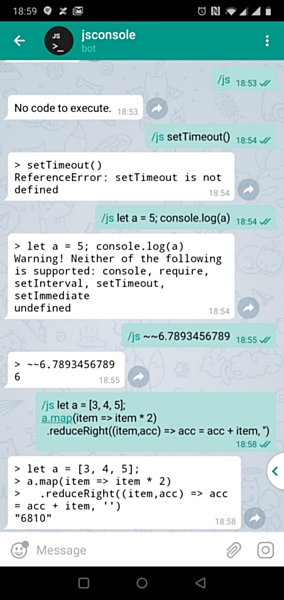

# JS Console Telegram Bot

JS Console Bot can be connected to a chat.
It listens to messages, executes the code,
and responds with the latest statement result.

**Examples:**

Request:

```
/js 6+1
```

Response:
```
> 6+1
7
```

Request:

```
/js const a = [1,2,3];
a.map(item => item * 2)
```

Response:
```
> const a = [1,2,3];
> a.map(item => item * 2);
[2, 4, 6]
```



The code is considered to be an untrusted user input
and executed in a jail. The app is stateless, which means
each code snippet is executed in isolation from past
sessions.

Original bot is named `jsconsole` and available
as [@okjs_bot](https://t.me/okjs_bot). You may also
add it to any group chat.

<!-- START doctoc generated TOC please keep comment here to allow auto update -->
<!-- DON'T EDIT THIS SECTION, INSTEAD RE-RUN doctoc TO UPDATE -->
## Table of Contents

- [Requirements Addressed](#requirements-addressed)
  - [Restrictions](#restrictions)
- [Setup](#setup)
  - [Install tools and dependencies](#install-tools-and-dependencies)
  - [Register your bot](#register-your-bot)
  - [First deployment](#first-deployment)
  - [Register the bot web hook with Telegram](#register-the-bot-web-hook-with-telegram)
  - [You're done!](#youre-done)
- [Developer's notes](#developers-notes)
  - [Project structure](#project-structure)
  - [App code base](#app-code-base)
    - [`jsconsole-bot.js`](#jsconsole-botjs)
    - [`sandbox.js`](#sandboxjs)
    - [`config.js`](#configjs)
  - [Web presentation](#web-presentation)
  - [App deployment setup](#app-deployment-setup)
    - [`.nowignore`](#nowignore)
    - [`now.json`](#nowjson)
    - [`package.json`](#packagejson)
    - [`setup.sh`](#setupsh)
- [Credits](#credits)

<!-- END doctoc generated TOC please keep comment here to allow auto update -->
<!-- generated with [DocToc](https://github.com/thlorenz/doctoc) -->

## Requirements Addressed

As a user I want to
- submit a code snippet so I can
  get the result output immediately
- have result output neatly formatted

As a service owner I want to
- restrict the resource
  used to run user code snippets so everyone can 
  benefit from free hosting tier.
- safely process untrusted user input
- benefit from NodeJS hosting free tier
- benefit from simple app deployment

### Restrictions

The following restrictions are applied:
 * source code length
 * execution time
 * restricted native API:
   - `console.log()` output isn't presented
   - `setTimeout`, `require`, `setInterval`, `setTimeout`, 
     `setImmediate` are unavailable
 
See [`config.js`](./api/config.js) and 
[vm2/VM docs](https://github.com/patriksimek/vm2/blob/master/README.md#VM)
for details.

## Setup

This app is developed to run on `now` platform by
[zeit](https://zeit.co/now#whats-now).

Installation workflow:
1. Install tools and dependencies
1. Register the bot and store Telegram API access token
1. Deploy bot as a lambda on `now`
1. Register bot webhook with Telegram 

The below instructions are valid as of June 03, 2019

### Install tools and dependencies

You are expected to have the following installed:
- NodeJS and npm.
  [NodeJS v8.10.0](https://nodejs.org/en/blog/release/v8.10.0/)
  is recommended (`now` hosting uses this version)
- [yarn](https://yarnpkg.com/en/docs/install) package manager

<details><summary>Note on NodeJS</summary>
<p>
It is recommended to use [nvm](https://github.com/nvm-sh/nvm/releases)
or [nvm for Windows](https://github.com/coreybutler/nvm-windows)
to manage NodeJS versions.

Under Windows open `cmd.exe` or `PowerShell` as administrator to use `nvm`.
</p>
</details>

Set up account on [zeit](https://zeit.co/). Integration with
GitHub is optional.

`./setup.sh install` will install dependencies and `now` CLI

You may need `sudo` installation.

Once `now` CLI is installed it is recommended to login
from your current device (normally it is done once for
all projects supported with `now`).

`./setup.sh login <your_email_associated_with_now_account>`

### Register your bot

Register your bot with [BotFather](https://telegram.me/botfather)
and take a note of API access token.

Store your token with `now` secrets storage.

`.setup.sh save_token <telegram_api_token>`

Now your token is securely stored and will be
- available at every device you have logged into `now` from
- supplied by `now` to the app at app execution

You may list stored secrets with `now secrets ls`.
You will not be able to retrieve the raw content of your secrets.
However, you always can consult [BotFather](https://telegram.me/botfather) 
to retrieve the token.

It is recommended that you store all secrets like credentials,
access tokens etc with a secrets storage, not as some plain text in
your code base.

### First deployment

`./setup.sh deploy`

Take a note of the complete url of your end-point alias.
Example: `https://jsconsole-bot.your-now-username.now.sh`

### Register the bot web hook with Telegram

Telegram needs to know where to send messages addressed to
your bot.

This end-point is called a web hook.

`./setup.sh set_webhook <your_project_url.now.sh> <telegram_api_token>`

### You're done!

You may want change something in your bot code.
Once you're ready to deploy just run `now`.

Your projects are accessible via [dashboard](https://zeit.co/dashboard). 
Each project lists all deployments. You may want to
delete obsolete deployments. You will also find logs useful. 

## Developer's notes

### Project structure

```
-\
 |-- api                   ## app code base
 |   |-- config.js         ## app config
 |   |-- jsconsole-bot.js  ## entry point / lambda function
 |   \-- sandbox.js        ## sandbox
 |
 |-- assets
 |   |-- jsconsole-bot.jpg    ## illustration
 |   \-- logo-JS-console.png  ## image used as bot's avatar in Telegram
 |
 |-- www                     ## web presentation
 |   |-- default-beauty.css  ## basic styling
 |   \-- index.html          ## default index.html
 |
 |-- .gitignore
 |-- .nowignore    ## files to be ignore by now
 |-- LICENSE.md
 |-- now.json      ## deployment setup
 |-- package.json  ## project properties
 |-- README.md
 |-- setup.sh      ## setup script
 \-- yarn.lock
```

### App code base

#### `jsconsole-bot.js`

`now` requires app entry points to export functions 
that are ready to serve network requests.
Since Telegram API sends messages via POST
and POST request body is not available synchronously
the function exported is async and `micro` is employed
to process the request properly.

[now examples](https://github.com/zeit/now-examples/tree/master/nodejs)
demonstrate GET requests processing, which are synchronous.

* `jsConsoleBot` (exported) - 
  an async function to serve requests
* `emulateConsoleInput` - a method to echo user input
  emulating console input; in bigger chats it may happen
  that some users may post before bot responds so
  echoing is helpful
* `sendMessage` - a method to send response using Telegram
  API

#### `sandbox.js`

* `executeInASandbox` (exported) - executes validated
  source code in a jail;
  uses [vm2](https://github.com/patriksimek/vm2)
* `validate` - validates source code against custom restrictions
* `stringify` - produces neatly formatted result output;
  uses [`stringify-object`](https://github.com/yeoman/stringify-object)
  by [yeoman](https://yeoman.io/)
  
The project uses is tested under
[NodeJS v8.10.0](https://nodejs.org/en/blog/release/v8.10.0/)
that is 
[used by zeit](https://zeit.co/docs/v2/deployments/official-builders/node-js-now-node#node.js-version)
as of writing this docs.

Newer NodeJS may cause 
[issues with output](https://github.com/patriksimek/vm2/issues/198).

#### `config.js`

* `telegramApiUrl` - [Telegram API](https://core.telegram.org/bots/api)
  v~4.3 url to send responses
  back to client; used in `jsconsole-bot.js`
* `sandBoxRestrictions` - custom user code restrictions;
  used in `sandbox.js`
* `sandBoxConfig` - sandbox config; used in `sandbox.js`

### Web presentation

These files are served whenever a user access the app via
browser at app domain root.

### App deployment setup

#### `.nowignore`

Files that 
[shouldn't be uploaded to `now`](https://zeit.co/guides/prevent-uploading-sourcepaths-with-nowignore).
Normally those are files that aren't required to build a project
and aren't used in production. 
Syntax is similar to that of `.gitignore`.

#### `now.json`

[`now` deployment configuration](https://zeit.co/docs/v2/deployments/configuration).

* `version` - platform version
* `name` - project name
* `builds` - project build settings, defining e.g.
  which files are static and should be served as is,
  and which should be processed by NodeJS before deployment
* `routes` - routing rules, defining e.g.
  what file to serve when a web user accesses project root
  and how a web hook (access point url) maps to a lambda
* `env` - env variables, accessible via `process.env` object;
  when value starts with `@` the real value is taken from
  `now` secrets storage

#### `package.json`

Note how `main` property points at your primary lambda function.
It might be also an `index.js` that sets up a local server for local tests. 

#### `setup.sh`

A script used to set the project up. 

## Credits

Telegram botification is inspired by
[How to build a telegram bot using Node.js and Now](https://scotch.io/tutorials/how-to-build-a-telegram-bot-using-nodejs-and-now)
[2018-10-19] and
[How to make a responsive telegram bot ](https://www.sohamkamani.com/blog/2016/09/21/making-a-telegram-bot/)
[2016-09-21].
